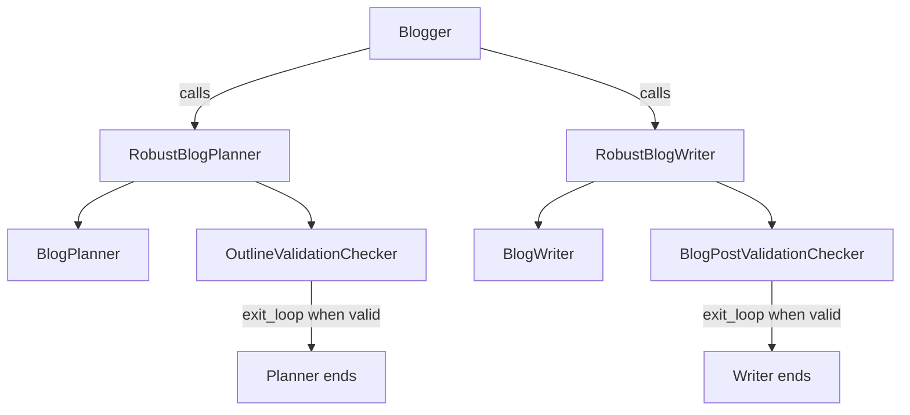

# Blog Writer with State Fixes

## Overview

This version preserves the original `AgentTool` and deprecated `LoopAgent`
structure so its corrections can be compared directly with the
[original sample](https://github.com/smithakolan/awesome-ai-agents/blob/056e5206adaa3cae3b71be070b65647d4984415e/build-ai-agent-google-adk).

Only the data-flow and loop-control problems are addressed:

- state values use `{blog_outline}` and `{blog_post}` templates;
- optional state values use `{key?}`;
- planner and writer agents consume validation feedback on retries;
- the two validators use separate feedback keys; and
- validators call `exit_loop` as soon as their content passes.

`LoopAgent` is deprecated in ADK 2, so this version is intended as a
before/after comparison.

## Sample Inputs

- `Top 3 use cases for AI agents`

## Topology



## How To

From the repository root:

```shell
adk web
```

Choose `agent_version` in the web UI.
