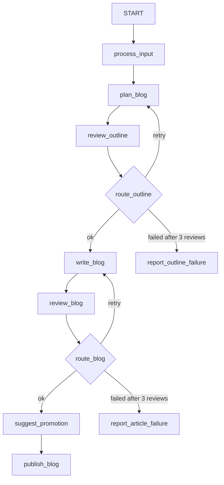

# Blog Writer Workflow

## Overview

This ADK 2 workflow reimplements the wrong [blog-writing agent](https://github.com/smithakolan/awesome-ai-agents/blob/056e5206adaa3cae3b71be070b65647d4984415e/build-ai-agent-google-adk/blogger/agent.py).

The workflow fixes the original implementation by:

- passing the outline and article through session state;
- using `{key}` instruction templates instead of referring to state keys as
  literal backticked names;
- expressing both revision loops as routed workflow edges rather than
  deprecated `LoopAgent` instances;
- using structured reviews to make loop termination deterministic;
- returning the approved article itself instead of asking a root agent to
  regenerate it from tool acknowledgements; and
- stopping after three failed reviews rather than looping forever or silently
  publishing content that failed validation.

## Sample Inputs

- `Top 3 use cases for AI agents`

- `How resumable graph workflows improve human-in-the-loop agents`

## Graph



## How To

From the repository root, run the parent directory so ADK can discover the
agent package:

```shell
adk web
```

Choose `workflow_version` in the web UI and enter a topic. The writer and
reviewer agents exchange data through `output_key` values in session state.
The `route_outline` and `route_blog` function nodes inspect typed `Review`
outputs and either cycle back to the corresponding generator or continue.

`publish_blog` is deliberately a function node. It copies the approved
`blog_post` from state verbatim and only appends the separately generated
alternate titles and social hooks.

## Test

Run the recorded integration example with:

```shell
adk test workflow_version
```

The `tests/review_loops_once.json` fixture mocks nine model responses. It
exercises both revision edges exactly once:

```text
BlogPlanner -> OutlineValidationChecker(retry)
            -> BlogPlanner -> OutlineValidationChecker(ok)
            -> BlogWriter -> BlogPostValidationChecker(retry)
            -> BlogWriter -> BlogPostValidationChecker(ok)
            -> Blogger -> publish_blog
```

Because `adk test` replays the model responses from the event recording, this
test does not call a live model or require an API key.
