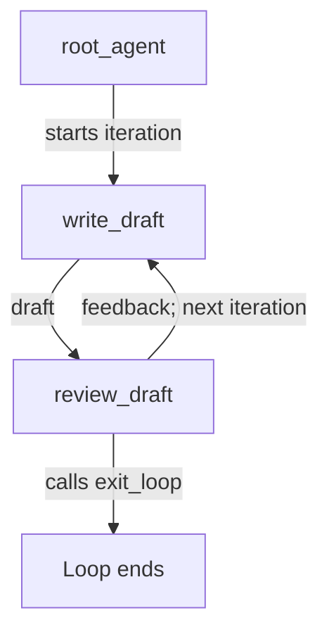

# ADK LoopAgent Review Sample

## Overview

This sample demonstrates iterative draft review with `LoopAgent`. A writer
creates an announcement and a reviewer either gives revision feedback or calls
the `exit_loop` tool.

The test fixture is intentionally written by hand. During `adk test`, its model
messages are replayed as deterministic model responses, so both a revision and
the successful exit path are tested without calling a model API.

## Sample Inputs

- `Announce that the project has started.`

## Graph

## How To

The writer stores each response in `current_draft`. The reviewer reads that
state and stores its response in `review_feedback`, which becomes available to
the writer on the next iteration.

The reviewer receives the built-in `exit_loop` tool. When the draft is ready,
the reviewer calls the tool, which sets `event.actions.escalate` to `True`;
`LoopAgent` observes that action and exits.

## Related Guides

- [Workflow](https://github.com/google/adk-python/blob/main/docs/guides/workflow/workflow/index.md) - How workflows
  provide deterministic agent orchestration.
- [Events](https://github.com/google/adk-python/blob/main/docs/guides/events/event/index.md) - How events carry
  content, state changes, and actions.
- [Workflow Graph](https://github.com/google/adk-python/blob/main/docs/guides/workflow/graph/index.md) - The graph
  concepts used to replace workflow agents such as `LoopAgent`.
