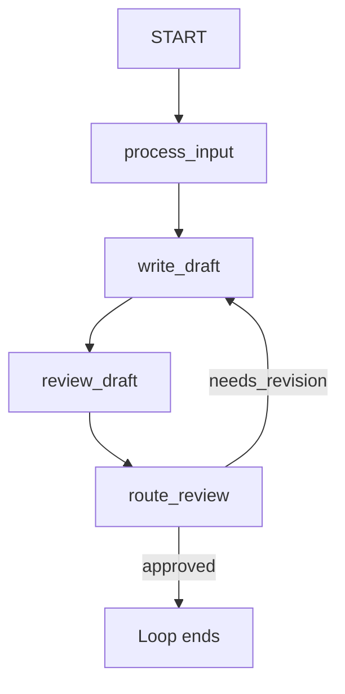

# ADK Workflow Review Loop Sample

## Overview

This sample migrates the [`LoopAgent` review sample](../adk_v1_style/README.md)
to an ADK Workflow. A structured review result and a conditional graph edge
replace the custom stop signal used by `LoopAgent`.

The hand-written test fixture supplies deterministic model responses to
`adk test`, exercising one revision before approval without calling a model
API.

## Sample Inputs

- `Announce that the project has started.`

## Graph

## How To

The writer and reviewer store their results in workflow state. The reviewer
uses the `Review` output schema, so `route_review` receives a typed value whose
grade is either `approved` or `needs_revision`.

The `needs_revision` route points back to `write_draft`. There is no outgoing
edge for `approved`, so that route ends the workflow. Unlike the `LoopAgent`
version, this workflow does not need the `exit_loop` tool. The graph makes the
loop and its exit condition explicit.

## Related Guides

- [Workflow](https://github.com/google/adk-python/blob/main/docs/guides/workflow/workflow/index.md) - How to define
  and run graph-based workflows.
- [Workflow Graph](https://github.com/google/adk-python/blob/main/docs/guides/workflow/graph/index.md) - How edges,
  routes, and cycles control execution.
- [Single-Turn LLM Agent](https://github.com/google/adk-python/blob/main/docs/guides/agents/llm_agent/single_turn.md)
  - How isolated LLM agent calls behave in workflows.
