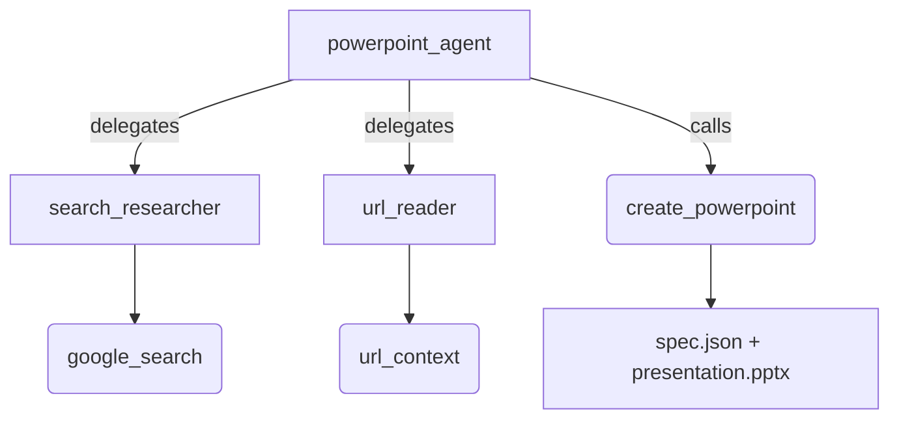

# PowerPoint Agent

## Overview

This sample recreates a search-first PowerPoint agent with ADK. The root agent
delegates web research to single-turn agents backed by `google_search` and
`url_context`, converts the findings into a typed deck specification, and calls
a deterministic `python-pptx` renderer. No outline or slide approval is
requested before rendering.

The ADK orchestration stays in `agent.py`; deck schemas and rendering live in
`_pptx_renderer.py` and are imported relatively within the sample package.

The renderer saves two session-scoped artifacts: the editable `.pptx` file and
the JSON specification used to generate it. Source URLs are printed in each
slide footer and copied into a `[Sources]` block in its speaker notes so
researched claims remain traceable.

## Sample Inputs

- `Create an 8-slide PowerPoint about Emily Stewart's activities in 2025. Cover game events, cards, collaborations, and live performances.`

- `このURLと関連する公式情報を調査して、一般向けに6枚の日本語スライドを作ってください: https://google.github.io/adk-docs/`

- `Compare ADK 1.x and ADK 2.x workflows in a concise presentation. Cite primary sources.`

## Graph



## How To

The two research agents use `mode='single_turn'`. ADK exposes them to the root
agent as tools while keeping each Gemini built-in tool isolated from the
`create_powerpoint` function tool:

```python
search_researcher = Agent(
    name="search_researcher",
    mode="single_turn",
    tools=[google_search],
)
```

The root passes `search_researcher` a natural-language research brief describing
the information and evidence it needs, rather than a keyword query. The
researcher breaks that brief into its own Google Search queries, follows gaps in
the evidence, and reports the queries it used alongside facts and direct source
URLs. This keeps search-query design inside the agent that owns web research.

The renderer receives validated Pydantic data and saves the generated bytes
through the unified ADK context, which records the artifact on the emitted
event:

```python
async def create_powerpoint(spec: DeckSpec, ctx: Context) -> dict[str, object]:
    payload = await asyncio.to_thread(render_presentation, spec)
    version = await ctx.save_artifact(
        "presentation.pptx",
        types.Part.from_bytes(data=payload, mime_type=_PPTX_MIME_TYPE),
    )
    return {"artifact_name": "presentation.pptx", "version": version}
```

## Related Guides

- [Artifacts](https://github.com/google/adk-python/blob/main/docs/guides/artifacts/artifact_service/index.md) - Explains versioned binary artifacts and storage backends.
- [Single-turn sub-agents](https://github.com/google/adk-python/blob/main/contributing/samples/managed_agent/single_turn/README.md) - Shows how ADK exposes focused child agents as inline tools.
- [Function tools](https://github.com/google/adk-python/blob/main/contributing/samples/tools/function_tools/README.md) - Shows how typed Python functions are exposed to an agent.
- [Built-in multi-tools](https://github.com/google/adk-python/blob/main/contributing/samples/tools/built_in_multi_tools/README.md) - Covers the compatibility boundary between Gemini built-in and custom tools.
